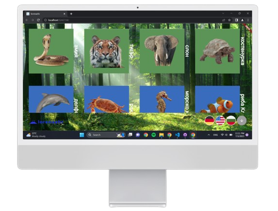

<h1 align="center">Lorena-Bubole4ka project/h1>
<p align="center">

</p>

## 🖥 Team
Lorena Hristova

## 🚀 Languages 

<p align="left"> 
     
    
    
    
    
    
     

  ## 🔧 Tools 
  <p align="left"> 
    
    
    
      
 ## 📋 Description
    
*This project shows differents types of animals - animals inhabiting the earth, the sky, the water and those that live in both terrestrial and aquatic environments. There are examples of those types of animals and when you click on the photos you can see different images of the animals.-*   
      
 ## 📄 Documents
      
- [Word Documentation](https://codingburgas-my.sharepoint.com/:w:/g/personal/sysolakov20_codingburgas_bg/EbVJJMJHvAFLl7hX-e8m6IMBDULhAsUT_3YhBrngkOruqQ?e=H3CfLV)
- [PowerPoint Presentation](https://codingburgas-my.sharepoint.com/:p:/g/personal/sysolakov20_codingburgas_bg/EXv395rgGdpHqVZFLU5n2vEB0z7IRLcUZEfh0oayBEjgaQ?e=SzXvfj)
- [Design Documentation](https://codingburgas-my.sharepoint.com/:b:/g/personal/sysolakov20_codingburgas_bg/EVNvugMhCoxIr35jKeKSuxcBf0iWpWsszUG491FtHGVVSQ?e=waZLoe)
      
## 🎬 Demo of the project 

<p align="center">

</p>

## ⚙ Installation
```
You can download the project by using the green "Code" button.

Or by pasting the following code in your CMD:
git clone https://github.com/LSHristova20/bubolechka2.git
```
## Thank you for using our app
If you support and like our project, you can always share it with people on social media.
   
